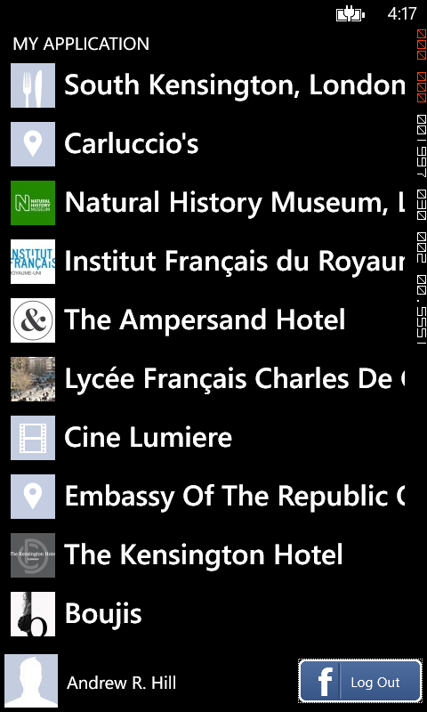
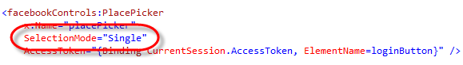
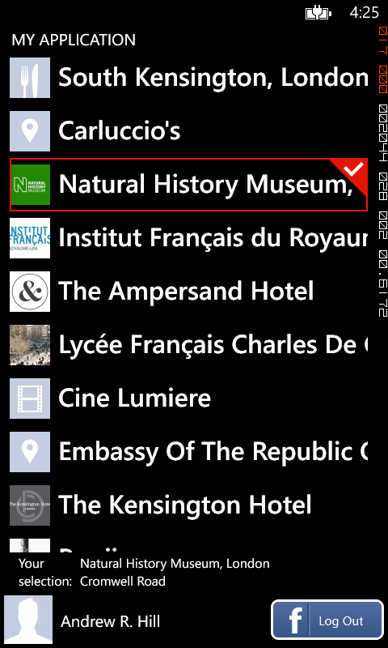
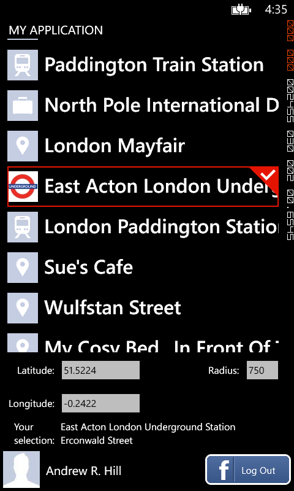
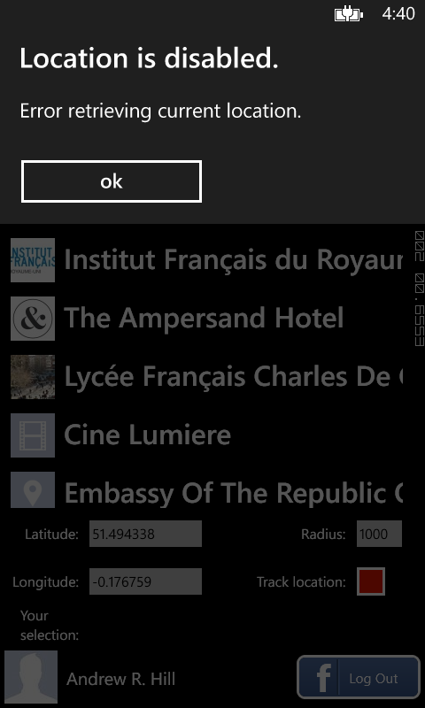
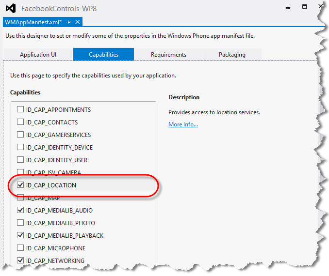
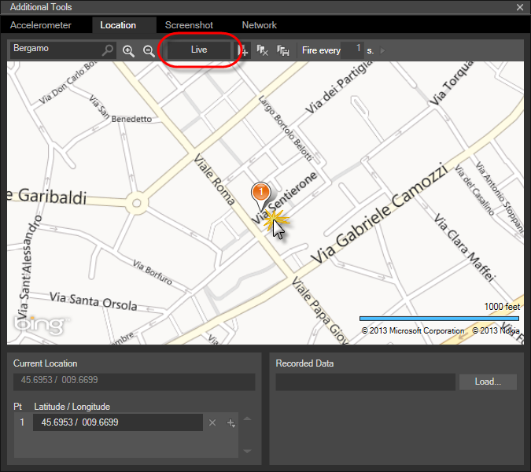
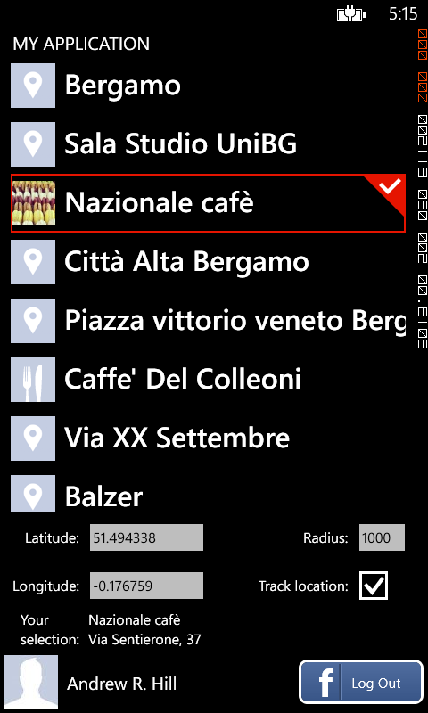
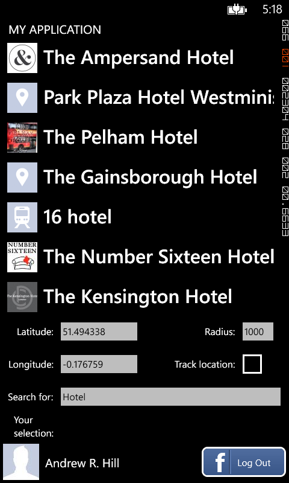

In this document:

* [Overview](#1)
* [Using the PlacePicker Control](#2)
* [See Also](#3)

---

## Overview

The [PlacePicker](/docs/reference/client/Client.Controls.PlacePicker.html) control displays a user interface that you can use to pick places that are within a certain distance of a specified location. 

---

## Using the PlacePicker Control

In this tutorial, you will add a [PlacePicker](/docs/reference/client/Client.Controls.PlacePicker.html) control to an application that adds the capability for selecting places that are nearby. This tutorial builds on top of the [LoginButton control tutorial](/docs/windows/controls/login-ui-control/), which you need to complete before proceeding; in particular, you should have already added the **Facebook.Client NuGet** to your project as well as inserted and configured a [LoginButton](/docs/reference/client/Client.Controls.LoginButton.html) in your page.

1.	Open the **MainPage.xaml** page of the application that you created for the [LoginButton control tutorial](/docs/windows/controls/login-ui-control/). Alternatively, you can start with the result of the [ProfilePicture control tutorial](/docs/windows/controls/profilepicture-ui-control/), which also adds a [ProfilePicture](/docs/reference/client/Client.Controls.ProfilePicture.html) control to the page.

1.	In the content panel area in the center row, locate the **Grid** element and replace any nested content with a [PlacePicker](/docs/reference/client/Client.Controls.PlacePicker.html) control, binding its **AccessToken** property to the property of the same name in the **CurrentSession** object of the **LoginButton**, as shown below.

        <!--ContentPanel - place additional content here-->
        <Grid x:Name="ContentPanel" Grid.Row="1" Margin="12,0,12,0" Visibility="Collapsed">            
            <facebookControls:PlacePicker 
                x:Name="placePicker" 
                AccessToken="{Binding CurrentSession.AccessToken, ElementName=loginButton}" />
        </Grid>

1.	Build and run the application and click **Log In** to retrieve a list of places near the default location, which is in South Kensington, London, for no particular reason. Of course, unless users of your application are only interested in searching for places in and around South Kensington, it will be necessary to provide coordinates around which to search, which you will learn how to do shortly.
 
	

1.	Stop the running application.

1.	Locate the **Grid** element that defines the content section of the page and insert the following row definitions to create a two-row layout in this section, with the top row reserved for the [PlacePicker](/docs/reference/client/Client.Controls.PlacePicker.html) control and the bottom row for the details view.

        <!--ContentPanel - place additional content here-->
        <Grid x:Name="ContentPanel" Grid.Row="1" Margin="12,0,12,0" Visibility="Collapsed">
            <Grid.RowDefinitions>
                <RowDefinition />
                <RowDefinition Height="Auto"/>
            </Grid.RowDefinitions>

            <facebookControls:PlacePicker 
                x:Name="placePicker" 
                AccessToken="{Binding CurrentSession.AccessToken, ElementName=loginButton}" />
        </Grid>

1.	To define the details view, insert another **Grid** element nested inside the content area, placing it immediately below the **PlacePicker**. The row and column definitions create the layout of the details section. 

        <!-- details section -->
        <Grid Grid.Row="1" Margin="2">
            <Grid.RowDefinitions>
                <RowDefinition Height="Auto"/>
                <RowDefinition Height="Auto"/>
                <RowDefinition Height="Auto"/>
                <RowDefinition Height="Auto"/>
            </Grid.RowDefinitions>
            <Grid.ColumnDefinitions>
                <ColumnDefinition Width="1*" />
                <ColumnDefinition Width="2*" />
                <ColumnDefinition Width="2*" />
                <ColumnDefinition Width="1*" />
            </Grid.ColumnDefinitions>
        </Grid>

1.	The [PlacePicker](/docs/reference/client/Client.Controls.PlacePicker.html) control offers several modes of selection including _None_, _Single_, _Multiple_, and _Extended_, which you specify using the **SelectionMode** property. The current selection is available through the **SelectedItem** property, when the **SelectionMode** is specified as _Single_, or through the **SelectedItems** property for the multiple item selection modes. Change the **SelectionMode** property of the control to _Single_, as shown below.
 
	

1.	To show the current selection, insert the following XAML markup inside the details section adding a couple of text block elements bound to the **SelectedItem** property of the [PlacePicker](/docs/reference/client/Client.Controls.PlacePicker.html). The first text block shows the name of the current selection and the second one, its street address.

        <!-- current selection -->
        <TextBlock 
            Grid.Row="3" Grid.Column="0"
            HorizontalAlignment="Right" 
            VerticalAlignment="Top"
            TextWrapping="Wrap" 
            TextAlignment="Left"
            FontSize="16"
            Text="Your selection:" />
        <StackPanel Grid.Row="3" Grid.Column="1" Grid.ColumnSpan="3" Margin="10,0,0,0" Orientation="Vertical">
            <TextBlock
                VerticalAlignment="Top"
                FontSize="16"
                Text="{Binding SelectedItem.Name, ElementName=placePicker}" />
            <TextBlock
                VerticalAlignment="Top"
                FontSize="16"
                Text="{Binding SelectedItem.Location.Street, ElementName=placePicker}" />
        </StackPanel>

1.	Build and run the application. Navigate around the list shown by the [PlacePicker](/docs/reference/client/Client.Controls.PlacePicker.html) selecting different places as you scroll, and notice how the lower panel updates to show information about the current selection.
 
	

1.	As mentioned previously, unless a search location is configured, the control returns search results for the default location. To specify a different location, the control provides **Latitude** and **Longitude** properties, which you can initialize to indicate the center of the area around which you wish to search for places. Insert the following XAML markup in the details section, adding a couple of text boxes bound to the aforementioned properties.

        <!-- latitude and longitude -->
        <TextBlock 
            Grid.Row="0" Grid.Column="0" 
            HorizontalAlignment="Right" 
            VerticalAlignment="Center"
            FontSize="16"
            Text="Latitude:" />
        <TextBox 
            x:Name="latitude" 
            Grid.Row="0" Grid.Column="1" 
            Margin="0"
            FontSize="16"
            BorderThickness="0"
            HorizontalAlignment="Stretch" 
            VerticalAlignment="Center"
            Text="{Binding ElementName=placePicker, Path=Latitude, Mode=TwoWay}" />
        <TextBlock 
            Grid.Row="1" Grid.Column="0" 
            FontSize="16"
            HorizontalAlignment="Right" 
            VerticalAlignment="Center"
            Text="Longitude:" />
        <TextBox 
            x:Name="longitude" 
            Grid.Row="1" Grid.Column="1" 
            Margin="0"
            FontSize="16"
            BorderThickness="0"
            HorizontalAlignment="Stretch" 
            VerticalAlignment="Center"
            Text="{Binding ElementName=placePicker, Path=Longitude, Mode=TwoWay}" />

1.	In addition to specifying a location, you may also want to indicate the maximum distance from this location for which to return search results. By default, the [PlacePicker](/docs/reference/client/Client.Controls.PlacePicker.html) returns places to be found within 1000 meters of the search location. However, you can change this distance by setting the value of the **RadiusInMeters** property. Insert the following XAML markup inside the details section adding a **TextBox** that will allow control of this property.

        <!-- search radius -->
        <TextBlock
            Grid.Row="0" Grid.Column="2" 
            FontSize="16"
            HorizontalAlignment="Right" 
            VerticalAlignment="Center"
            Text="Radius:" />
        <TextBox 
            x:Name="radius" 
            Grid.Row="0" Grid.Column="3" 
            Margin="0"
            FontSize="16"
            BorderThickness="0"
            HorizontalAlignment="Stretch" 
            VerticalAlignment="Center"
            Text="{Binding ElementName=placePicker, Path=RadiusInMeters, Mode=TwoWay}" />

1.	Build and run the application. Enter a new location by specifying its coordinates and change the search radius. Verify that the search results shown by the [PlacePicker](/docs/reference/client/Client.Controls.PlacePicker.html) update to reflect your new settings.
 
	

1.	Another useful feature of the [PlacePicker](/docs/reference/client/Client.Controls.PlacePicker.html) control is its location tracking capability. Many applications require search results that are based on the user’s current location. The [PlacePicker](/docs/reference/client/Client.Controls.PlacePicker.html) control takes advantage of support available in the platform to determine the current geographic location. To enable this feature, the **LocationTracking** property must be set to _true_. Once enabled, the control returns search results for places that are within the maximum search radius from the current position, overriding the values specified by the **Latitude** and **Longitude** properties. Insert the following XAML markup inside the details section, adding a checkbox that will allow control of this setting.

        <!-- location tracking -->
        <TextBlock                    
            Grid.Row="1" Grid.Column="2" 
            Margin="0"
            FontSize="16"
            HorizontalAlignment="Right" 
            VerticalAlignment="Center"
            TextWrapping="Wrap"
            Text="Track location:" />
        <CheckBox 
            x:Name="trackLocation" 
            Grid.Row="1" Grid.Column="3" 
            Margin="0,-20"
            HorizontalAlignment="Left"
            VerticalAlignment="Center"
            IsChecked="{Binding ElementName=placePicker, Path=TrackLocation, Mode=TwoWay}"/>

1.	Before running the application, create a handler for the **LoadFailed** event of the control, which reports any errors that occur while the [PlacePicker](/docs/reference/client/Client.Controls.PlacePicker.html) retrieves its data.
  
	

1.	Update the body of the generated event handler in the code-behind file with the following content.

		private async void OnPlacePickerLoadFailed(object sender, Facebook.Client.Controls.LoadFailedEventArgs e)
		{
			var alert = new Windows.UI.Popups.MessageDialog(e.Description, e.Reason);
			await alert.ShowAsync();
		}
	
1.	Build and run the application again. Click **Track location** to enable the feature and notice that the **LoadFailed** event is raised, indicating that an error has occurred. Unless the Location capability is first declared in the application’s manifest, the application is not allowed access to your location. Stop the running application.
 
	

1.	To allow the application to access location data, expand the **Properties** folder in Solution Explorer and double-click **WMAppManifest.xml** to open the application manifest editor. Switch to the **Capabilities** tab and enable the **Location** capability. Save your changes.
 
	

1. Run the application and once more, click **Track location.**. To test the location tracking feature, you will use the location sensor simulator in the Windows Phone Emulator. Click the chevron button in the emulator to open the **Additional Tools** window, and then select the **Location** tab.

1. Turn on live input mode by toggling the **Live** button. If the **Live** button is grayed out, live input mode is off. In the **Search** box, type the location you want to display in the map and press **Enter**. Zoom in or out from the map location and reposition the map until you find the desired location. Then, click the map to trigger location changed events that the PlacePicker uses to search for new data and update its list of places.
 
	

1.	After you allow the application to obtain location data, the [PlacePicker](/docs/reference/client/Client.Controls.PlacePicker.html) tracks the current location and returns a list of places around it.
 
	

1.	So far, the application uses the [PlacePicker](/docs/reference/client/Client.Controls.PlacePicker.html) to return search results for any place within the specified distance from the search location. To search for specific places, the control includes a **SearchText** property where you specify search words that narrow down the returned results. To input search terms, insert the following XAML markup inside the details section, adding a text box bound to the **SearchText** property of the control.

        <!-- search text -->
        <TextBlock 
            Grid.Row="2" Grid.Column="0" 
            FontSize="16"
            HorizontalAlignment="Right" 
            VerticalAlignment="Center"
            Text="Search for:" />
        <TextBox 
            x:Name="searchText" 
            Grid.Row="2" Grid.Column="1" Grid.ColumnSpan="3"
            Margin="0,0,-12,0"
            BorderThickness="0"
            FontSize="16"
            HorizontalAlignment="Stretch" 
            VerticalAlignment="Center"
            Text="{Binding ElementName=placePicker, Path=SearchText, Mode=TwoWay}" />

1.	The application for this tutorial is ready at this point. The complete XAML for the page is shown below. Compare it with your work to ensure that you have followed the steps of the tutorial correctly.

        <phone:PhoneApplicationPage
            x:Class="FacebookControls_WP8.MainPage"
            xmlns="http://schemas.microsoft.com/winfx/2006/xaml/presentation"
            xmlns:x="http://schemas.microsoft.com/winfx/2006/xaml"
            xmlns:phone="clr-namespace:Microsoft.Phone.Controls;assembly=Microsoft.Phone"
            xmlns:shell="clr-namespace:Microsoft.Phone.Shell;assembly=Microsoft.Phone"
            xmlns:d="http://schemas.microsoft.com/expression/blend/2008"
            xmlns:mc="http://schemas.openxmlformats.org/markup-compatibility/2006"
            xmlns:facebookControls="clr-namespace:Facebook.Client.Controls;assembly=Facebook.Client"
            mc:Ignorable="d"
            FontFamily="{StaticResource PhoneFontFamilyNormal}"
            FontSize="{StaticResource PhoneFontSizeNormal}"
            Foreground="{StaticResource PhoneForegroundBrush}"
            SupportedOrientations="Portrait" Orientation="Portrait"
            shell:SystemTray.IsVisible="True">

            <!--LayoutRoot is the root grid where all page content is placed-->
            <Grid x:Name="LayoutRoot" Background="Transparent">
                <Grid.RowDefinitions>
                    <RowDefinition Height="Auto"/>
                    <RowDefinition Height="*"/>
                    <RowDefinition Height="Auto"/>
                </Grid.RowDefinitions>

                <!--TitlePanel contains the name of the application and page title-->
                <StackPanel Grid.Row="0" Margin="2">
                    <TextBlock Text="MY APPLICATION" Style="{StaticResource PhoneTextNormalStyle}"/>
                </StackPanel>

                <!--ContentPanel - place additional content here-->
                <Grid x:Name="ContentPanel" Grid.Row="1" Margin="12,0,12,0" Visibility="Collapsed">
                    <Grid.RowDefinitions>
                        <RowDefinition />
                        <RowDefinition Height="Auto"/>
                    </Grid.RowDefinitions>

                    <facebookControls:PlacePicker 
                        x:Name="placePicker" 
                        SelectionMode="Single"
                        LoadFailed="OnPlacePickerLoadFailed"
                        AccessToken="{Binding CurrentSession.AccessToken, ElementName=loginButton}" />

                    <!-- details section -->
                    <Grid Grid.Row="1" Margin="2">
                        <Grid.RowDefinitions>
                            <RowDefinition Height="Auto"/>
                            <RowDefinition Height="Auto"/>
                            <RowDefinition Height="Auto"/>
                            <RowDefinition Height="Auto"/>
                        </Grid.RowDefinitions>
                        <Grid.ColumnDefinitions>
                            <ColumnDefinition Width="1*" />
                            <ColumnDefinition Width="2*" />
                            <ColumnDefinition Width="2*" />
                            <ColumnDefinition Width="1*" />
                        </Grid.ColumnDefinitions>

                        <!-- current selection -->
                        <TextBlock 
                            Grid.Row="3" Grid.Column="0"
                            HorizontalAlignment="Right" 
                            VerticalAlignment="Top"
                            TextWrapping="Wrap" 
                            TextAlignment="Left"
                            FontSize="16"
                            Text="Your selection:" />
                        <StackPanel Grid.Row="3" Grid.Column="1" Grid.ColumnSpan="3" Margin="10,0,0,0" Orientation="Vertical">
                            <TextBlock
                                VerticalAlignment="Top"
                                FontSize="16"
                                Text="{Binding SelectedItem.Name, ElementName=placePicker}" />
                            <TextBlock
                                VerticalAlignment="Top"
                                FontSize="16"
                                Text="{Binding SelectedItem.Location.Street, ElementName=placePicker}" />
                        </StackPanel>

                        <!-- latitude and longitude -->
                        <TextBlock 
                            Grid.Row="0" Grid.Column="0" 
                            HorizontalAlignment="Right" 
                            VerticalAlignment="Center"
                            FontSize="16"
                            Text="Latitude:" />
                        <TextBox 
                            x:Name="latitude" 
                            Grid.Row="0" Grid.Column="1" 
                            Margin="0"
                            FontSize="16"
                            BorderThickness="0"
                            HorizontalAlignment="Stretch" 
                            VerticalAlignment="Center"
                            Text="{Binding ElementName=placePicker, Path=Latitude, Mode=TwoWay}" />
                        <TextBlock 
                            Grid.Row="1" Grid.Column="0" 
                            FontSize="16"
                            HorizontalAlignment="Right" 
                            VerticalAlignment="Center"
                            Text="Longitude:" />
                        <TextBox 
                            x:Name="longitude" 
                            Grid.Row="1" Grid.Column="1" 
                            Margin="0"
                            FontSize="16"
                            BorderThickness="0"
                            HorizontalAlignment="Stretch" 
                            VerticalAlignment="Center"
                            Text="{Binding ElementName=placePicker, Path=Longitude, Mode=TwoWay}" />

                        <!-- search radius -->
                        <TextBlock
                            Grid.Row="0" Grid.Column="2" 
                            FontSize="16"
                            HorizontalAlignment="Right" 
                            VerticalAlignment="Center"
                            Text="Radius:" />
                        <TextBox 
                            x:Name="radius" 
                            Grid.Row="0" Grid.Column="3" 
                            Margin="0"
                            FontSize="16"
                            BorderThickness="0"
                            HorizontalAlignment="Stretch" 
                            VerticalAlignment="Center"
                            Text="{Binding ElementName=placePicker, Path=RadiusInMeters, Mode=TwoWay}" />

                        <!-- location tracking -->
                        <TextBlock                    
                            Grid.Row="1" Grid.Column="2" 
                            Margin="0"
                            FontSize="16"
                            HorizontalAlignment="Right" 
                            VerticalAlignment="Center"
                            TextWrapping="Wrap"
                            Text="Track location:" />
                        <CheckBox 
                            x:Name="trackLocation" 
                            Grid.Row="1" Grid.Column="3" 
                            Margin="0,-20"
                            HorizontalAlignment="Left"
                            VerticalAlignment="Center"
                            IsChecked="{Binding ElementName=placePicker, Path=TrackLocation, Mode=TwoWay}"/>

                        <!-- search text -->
                        <TextBlock 
                            Grid.Row="2" Grid.Column="0" 
                            FontSize="16"
                            HorizontalAlignment="Right" 
                            VerticalAlignment="Center"
                            Text="Search for:" />
                        <TextBox 
                            x:Name="searchText" 
                            Grid.Row="2" Grid.Column="1" Grid.ColumnSpan="3"
                            Margin="0,0,-12,0"
                            BorderThickness="0"
                            FontSize="16"
                            HorizontalAlignment="Stretch" 
                            VerticalAlignment="Center"
                            Text="{Binding ElementName=placePicker, Path=SearchText, Mode=TwoWay}" />
                    </Grid>
                </Grid>

                <!--user information-->
                <StackPanel 
                    Grid.Row="2" 
                    Orientation="Horizontal" 
                    HorizontalAlignment="Left" 
                    Margin="5">
                    <facebookControls:ProfilePicture 
                        x:Name="profilePicture"
                        Width="60"
                        Height="60" 
                        CropMode="Original" 
                        ProfileId="{Binding CurrentSession.FacebookId, ElementName=loginButton}" />
                    <TextBlock 
                        Margin="10,0,0,0"
                        HorizontalAlignment="Center"
                        VerticalAlignment="Center" 
                        Text="{Binding CurrentUser.Name, ElementName=loginButton}" />
                </StackPanel>

                <!-- login control -->
                <facebookControls:LoginButton 
                    x:Name="loginButton" 
                    Grid.Row="2" 
                    Margin="5"
                    HorizontalAlignment="Right" 
                    ApplicationId="427365490674294" 
                    SessionStateChanged="OnSessionStateChanged" />
            </Grid>

        </phone:PhoneApplicationPage>
	
1.	Build and run the application. Type a search term into the text box and verify that the [PlacePicker](/docs/reference/client/Client.Controls.PlacePicker.html) results match your search criteria.
 
	

---

## See Also

