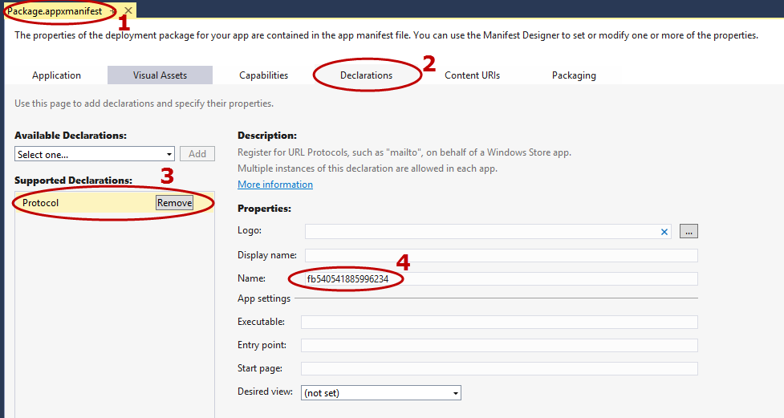

##Introduction
Before you can use the Facebook.Client SDK, you need to supply some configuration in your application. In particular, you need to configure your app to provide its Facebook Application ID. Additionally, there is a bit of code that needs to be  put in your app so that it can respond to protocol activation.

##Configuring Facebook AppID. 
We have changed the way you supply the Facebook AppID since version 0.99 of the SDK. Now the SDK expects you to put your Facebook application ID in a an XML file with the name **FacebookConfig.xml** in the root folder of your application. Put the following contents in your application. You will not be needing to add the Facebook AppID any place else.

### FacebookConfig.xml

    <?xml version="1.0" encoding="utf-8" ?>
    <Extensions>
        <Facebook AppId="Insert your Facebook App ID here" />
    </Extensions>

### Package.appxmanifest

Double click your package.appxmanifest in Visual Studio and select the Declarations tab. Add a protocol declaration and add a protocol by the name **fb<Facebook App Id>** in there. Save the manifest. This is how it will look like:

## Configuring protocol launch

The SDK has changed the way you get notified of success from the Facebook authentication. 

### Windows Phone 8.1
Windows Phone 8.1 supports login via the Mobile Internet Explorer, Webview and the App. Login via the Facebook App or via Mobile Internet Explorer required that calling app be suspended while the authentication happened out of process. Finally, after authentication, the caller would be invoked again. Thus, the architecture of the SDK now includes an application wide callback handler that should be setup as soon as the app starts. To ensure that your app can receive the callbacks after the authentication, make sure that you add an **OnActivated** event handler in your **App.xaml.cs** to handle the protocol launch. You MUST call the following line in your **OnActivated** event handler for the app to successfully obtain authentication information: 

    LifecycleHelper.FacebookAuthenticationReceived(protocolArgs);

A full *OnActivated* function call will look something like the below:

    protected override void OnActivated(IActivatedEventArgs args)
    {
        base.OnActivated(args);
        var protocolArgs = args as ProtocolActivatedEventArgs;
        LifecycleHelper.FacebookAuthenticationReceived(protocolArgs);
    }

To resolve the LifecycleHelper class, you will also need to add the following *using* statement to your code:

    using Facebook.Client;

> Note: If you forget the above line, when your app receives the Authentication, no action will be taken by the SDK and your app will never receive a successful authentication notification.

## Setup a callback for login
If you want your app to be notified when the login has successfully finished, setup a callback so that you can be notified when any session state changes are made. Here is a sample

    protected override void OnActivated(IActivatedEventArgs args)
    {
        base.OnActivated(args);

       // You can setup a event handler to be called back when the authentication has finished
       Session.OnFacebookAuthenticationFinished += OnFacebookAuthenticationFinished;

        var protocolArgs = args as ProtocolActivatedEventArgs;
        LifecycleHelper.FacebookAuthenticationReceived(protocolArgs);
    }

     private void OnFacebookAuthenticationFinished(AccessTokenData session)
     {
       // here the authentication succeeded callback will be received.
       // put your login logic here
     }

That's it. You have finished configuring your Windows Phone 8.1/Windows 8.0/Windows 8.1 Universal/.NET CORE based app for Facebook and you should be able to following the [LoginButton sample](/docs/windows/controls/login-ui-control)

