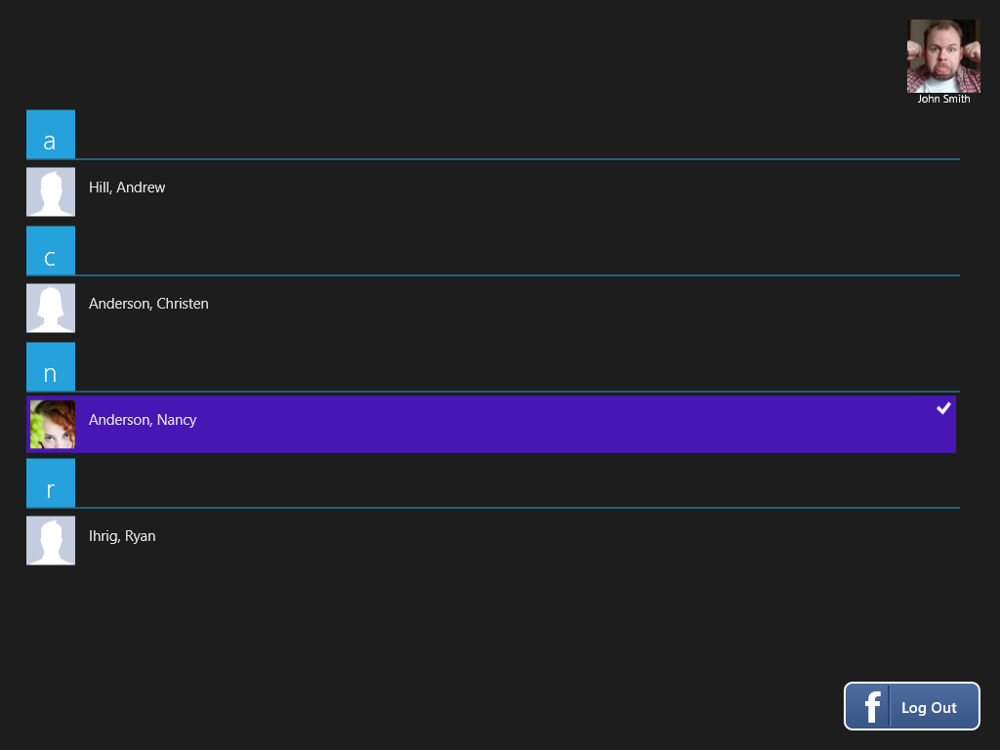
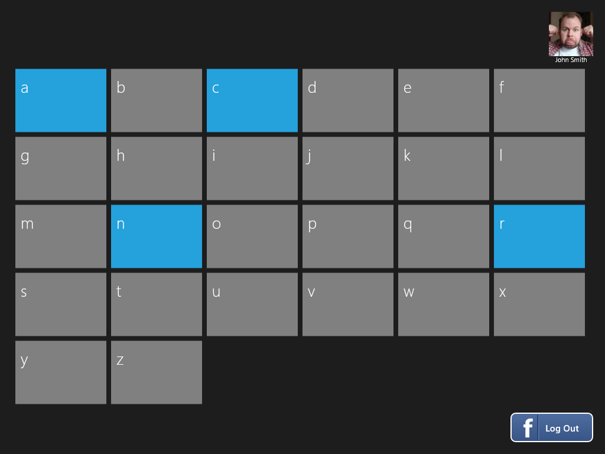
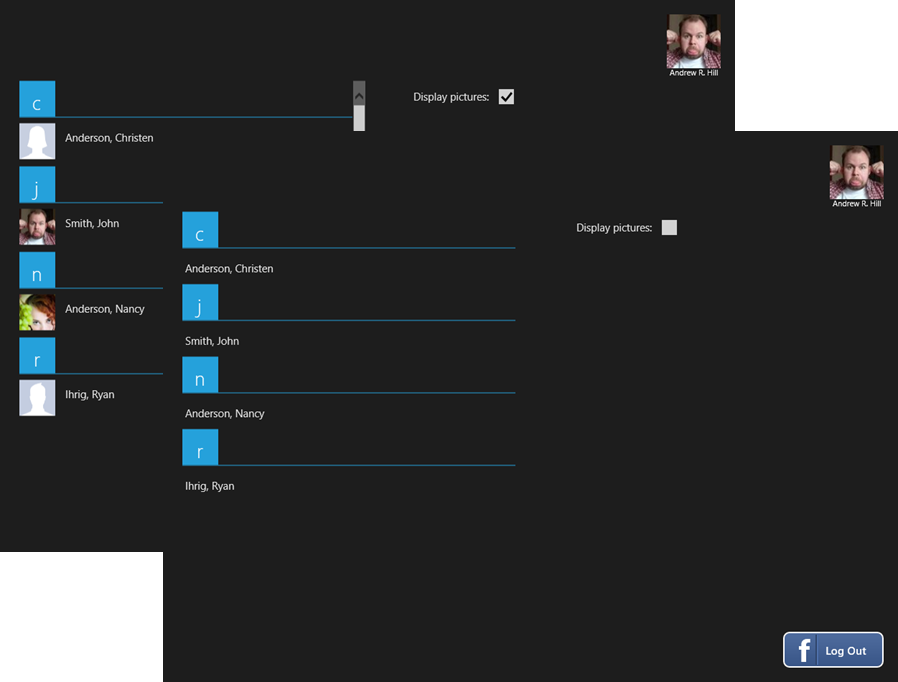
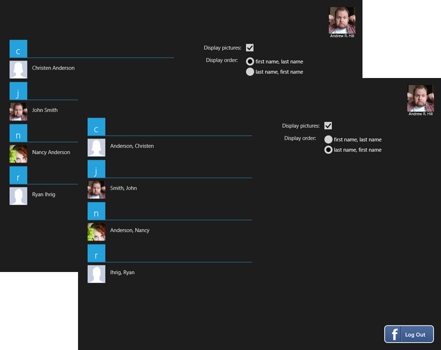
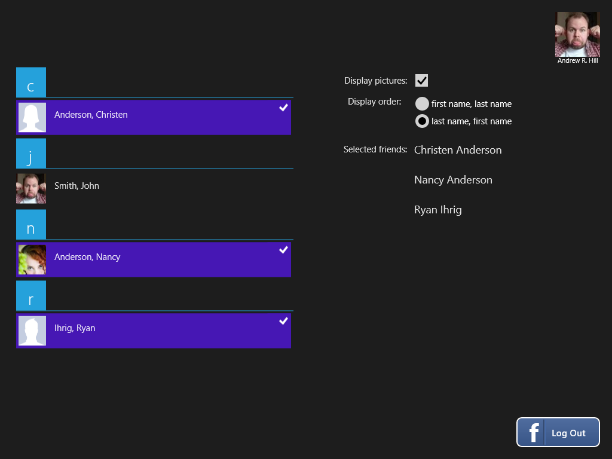
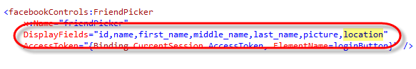
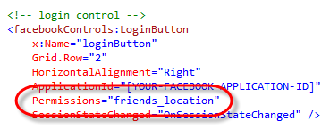
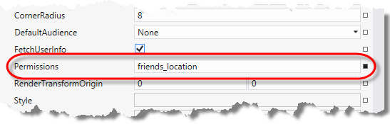
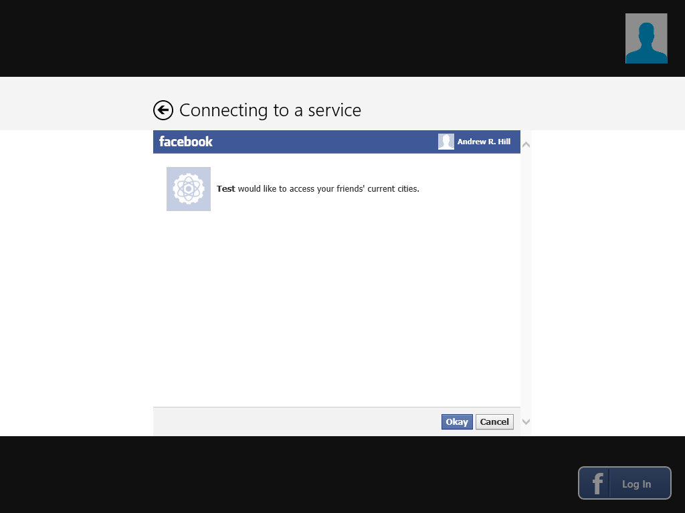
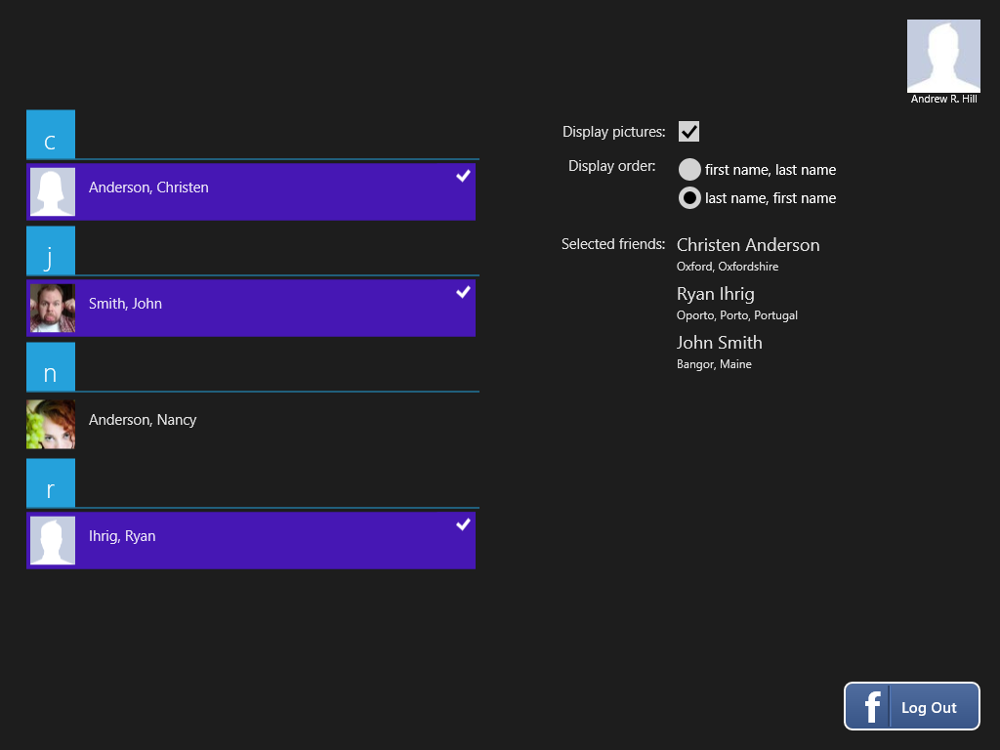

In this document:

* [Overview](#1)
* [Using the FriendPicker Control](#2)
* [See Also](#3)

---

## Overview

The [FriendPicker](/docs/reference/client/Client.Controls.FriendPicker.html) control displays a user interface that you can use to pick friends in your Facebook profile. 

---

## Using the FriendPicker Control

In this tutorial, you will add a [FriendPicker](/docs/reference/client/Client.Controls.FriendPicker.html) control to an application that adds the capability for selecting friends in your Facebook profile. This tutorial builds on top of the [LoginButton control tutorial](/docs/windows/controls/login-ui-control/), which you need to complete before proceeding; in particular, you should have already added the **Facebook.Client NuGet** to your project as well as inserted and configured a [LoginButton](/docs/reference/client/Client.Controls.LoginButton.html) in your page.

1.  Open the **MainPage.xaml** page of the application that you created for the [LoginButton control tutorial](/docs/windows/controls/login-ui-control/). Alternatively, you can start with the result of the [ProfilePicture control tutorial](/docs/windows/controls/profilepicture-ui-control/), which also adds a [ProfilePicture](/docs/reference/client/Client.Controls.ProfilePicture.html) control to the page.

1.  In the content area in the center row, locate the **Grid** element and replace any nested content with a [FriendPicker](/docs/reference/client/Client.Controls.FriendPicker.html) control, binding its **AccessToken** property to the property of the same name in the **CurrentSession** object of the **LoginButton**, as shown below.

        <!--ContentPanel - place additional content here-->
        <Grid x:Name="ContentPanel" 
            Grid.Row="1"
            Visibility="Collapsed">

            <facebookControls:FriendPicker 
                x:Name="friendPicker" 
                AccessToken="{Binding CurrentSession.AccessToken, ElementName=loginButton}" />
        </Grid>

1.  Build and run the application and click **Log In** to retrieve a list of friends in your Facebook profile.  

    

1.  Scroll through the list and notice how friends are categorized according to the first letter of their name.  If the list is extensive, finding a friend can be difficult. To make this task easier, the [FriendPicker](/docs/reference/client/Client.Controls.FriendPicker.html) control includes a jump list feature that allows you to quickly navigate through the list. To see it in action, click the heading for a category to zoom out and display the jump list.
 
    

1.  The jump list shows selectors for every letter in the alphabet. Selectors are highlighted to indicate that the group contains at least one member. Click any of the highlighted selectors to zoom in and navigate to that group.

1.  Click the entry for a friend in the list to select it. By default, multiple friends may be selected and clicking additional friends adds them to the current selection.

1.  Shut down the running program. You will now update the page to explore additional features of the [FriendPicker](/docs/reference/client/Client.Controls.FriendPicker.html) control by including a details view that shows the current selection and allows you to control some of its properties.

1.  Locate the **Grid** element that defines the content section of the page and insert the following column definitions to create a two-column layout in this section, with the left column reserved for the [FriendPicker](/docs/reference/client/Client.Controls.FriendPicker.html) control and the right column for the details view.

        <!--ContentPanel - place additional content here-->
        <Grid x:Name="ContentPanel" 
            Grid.Row="1"
            Visibility="Collapsed">
            <Grid.ColumnDefinitions>
                <ColumnDefinition/>
                <ColumnDefinition/>
            </Grid.ColumnDefinitions>
            
            <facebookControls:FriendPicker 
                x:Name="friendPicker" 
                AccessToken="{Binding CurrentSession.AccessToken, ElementName=loginButton}" />
        </Grid>

1.  To define the details view, insert another **Grid** element nested inside the content area, placing it immediately below the **FriendPicker**. The row and column definitions create the layout of the details section. 

        <!-- details section -->
        <Grid
            Grid.Column="1"
            Margin="20,0">
            <Grid.RowDefinitions>
                <RowDefinition Height="50"/>
                <RowDefinition Height="80"/>
                <RowDefinition />
            </Grid.RowDefinitions>
            <Grid.ColumnDefinitions>
                <ColumnDefinition Width="150"/>
                <ColumnDefinition Width="*"/>
            </Grid.ColumnDefinitions>
        
        </Grid>

1.  By default, the [FriendPicker](/docs/reference/client/Client.Controls.FriendPicker.html) control displays a profile picture alongside the name of each friend shown in the list. This behavior is controlled by the **DisplayProfilePictures** property, which determines whether a picture is shown. To see how this property works, insert the following XAML markup inside the details section to display a check box that enables or disables the display of pictures.

        <!-- display pictures --> 
        <TextBlock 
            Grid.Row="0" Grid.Column="0" 
            Style="{StaticResource BasicTextStyle}" 
            HorizontalAlignment="Right" VerticalAlignment="Center"
            Text="Display pictures:" />
        <CheckBox 
            x:Name="displayPictures" 
            Grid.Row="0" Grid.Column="1"
            Margin="10,0"
            VerticalAlignment="Center"
            IsChecked="{Binding DisplayProfilePictures, ElementName=friendPicker, Mode=TwoWay}" />

1.  Build and run the application. Clear the check box to see the list change to display only the name of your friends.
 
    

1.  The order in which names are displayed, last name first or first name first, is determined by the **DisplayOrder** property. By default, names on the list show the last name first. To change the display order, insert the following XAML markup inside the details section adding radio buttons that control the display order.

        <!-- display order -->
        <TextBlock 
            Grid.Row="1" Grid.Column="0" 
            Margin="0"
            Style="{StaticResource BasicTextStyle}" 
            HorizontalAlignment="Right" VerticalAlignment="Top"
            Text="Display order:" />
        <StackPanel Orientation="Vertical"                        
            Grid.Row="1" Grid.Column="1"
            Margin="10,0"
            VerticalAlignment="Top">
            <RadioButton 
                x:Name="DisplayFirstNameFirst"
                Content="first name, last name" 
                GroupName="DisplayOrder" 
                Checked="OnDisplayOrderSelected" />
            <RadioButton 
                x:Name="DisplayLastNameFirst"
                Content="last name, first name" 
                GroupName="DisplayOrder" 
                IsChecked="True"
                Checked="OnDisplayOrderSelected" />
        </StackPanel>

1.  To respond to changes in the radio buttons and set the **DisplayOrder** property of the [FriendPicker](/docs/reference/client/Client.Controls.FriendPicker.html) control, add the following event handler to the page’s code-behind file. Note that you could also bind the radio buttons to the property by a creating a value converter instead of handling the event. 

		private void OnDisplayOrderSelected(object sender, RoutedEventArgs e)
		{
			if (this.friendPicker != null)
			{
				var choice = sender as RadioButton;
				this.friendPicker.DisplayOrder =
					(Facebook.Client.Controls.FriendPickerDisplayOrder)Enum.Parse(typeof(Facebook.Client.Controls.FriendPickerDisplayOrder), choice.Name);
			}
		}
    
1.  Build and run the application. Click the radio buttons to see the display order of the names change to match your selection.
 
    

1.  The [FriendPicker](/docs/reference/client/Client.Controls.FriendPicker.html) control offers several modes of selection including _None_, _Single_, _Multiple_, and _Extended_, which you specify using the **SelectionMode** property. The current selection is available through the **SelectedItems** property. To show the current selection, insert the following XAML markup inside the details section adding a **ListView** bound to the **SelectedItems** property of the [FriendPicker](/docs/reference/client/Client.Controls.FriendPicker.html).

        <!-- current selection -->
        <TextBlock 
            Grid.Row="2" Grid.Column="0" 
            Style="{StaticResource BasicTextStyle}" 
            HorizontalAlignment="Right" VerticalAlignment="Top"
            Text="Selected friends:" />
        <ListView 
            Grid.Row="2" Grid.Column="1" 
            Margin="8,-6"
            VerticalAlignment="Top"
            SelectionMode="None"
            ItemsSource="{Binding SelectedItems, ElementName=friendPicker}">
            <ListView.ItemTemplate>
                <DataTemplate>
                    <StackPanel Orientation="Vertical">
                        <TextBlock Text="{Binding Name}" Style="{StaticResource ItemTextStyle}" FontSize="18" />
                        <TextBlock Text="{Binding Location.City}" Style="{StaticResource ItemTextStyle}" FontSize="12" />
                    </StackPanel>
                </DataTemplate>
            </ListView.ItemTemplate>
        </ListView>

1.  Build and run the application. Select friends in the [FriendPicker](/docs/reference/client/Client.Controls.FriendPicker.html) and see how their names are added to the list on the right. Similarly, clearing any selected item in the [FriendPicker](/docs/reference/client/Client.Controls.FriendPicker.html) removes the name from this list.
 
    

1.  If you examine the item template for the **ListView** that displays the current selection, you will see that it not only binds the **Name** of the selected person, but also its **Location.City**. Despite this, when you ran the application before, you may have noticed that the list only showed the names of those people you selected. The reason is that the location data is not included by default among the information retrieved by the control. To include it, you need to update the **DisplayFields** property to add the _location_ field, as shown below. Notice that, by default, the control already retrieves other properties such as _id_, _first_, _middle_, and _last name_, and _picture_.
 
     

    

1.  One additional requirement needs to be fulfilled before full access to location data is possible. If you run the application now, you may notice that the list on the right does not display the location for some of your friends. Because location data is optional, it is possible that your friend’s profile does not include this information.  Another reason for the missing location data, is that you friend has restricted public access to their location. Nevertheless, and assuming your friend has already granted access to the location to his or her friends, you can request permission to retrieve this piece of information when you log in. To do this, locate the **LoginButton** on the page, and add _friends_location_ to the list of **Permissions**. This will ensure that the access token negotiated by the login control has permissions to retrieve your friends’ location.
 
     

    

1.  The sample application for this tutorial is ready at this point. The complete XAML for the page is shown below. Compare it with your work to ensure that you have followed the steps correctly.

		<Page
			x:Class="FacebookControls.MainPage"
			xmlns="http://schemas.microsoft.com/winfx/2006/xaml/presentation"
			xmlns:x="http://schemas.microsoft.com/winfx/2006/xaml"
			xmlns:local="using:FacebookControls"
			xmlns:d="http://schemas.microsoft.com/expression/blend/2008"
			xmlns:mc="http://schemas.openxmlformats.org/markup-compatibility/2006"
			xmlns:facebookControls="using:Facebook.Client.Controls"
			mc:Ignorable="d">
		
			<Grid Background="{StaticResource ApplicationPageBackgroundThemeBrush}">
				<Grid Margin="20">
					<Grid.RowDefinitions>
						<RowDefinition Height="Auto"/>
						<RowDefinition/>
						<RowDefinition Height="Auto"/>
					</Grid.RowDefinitions>
		
					<!--user information-->
					<StackPanel HorizontalAlignment="Right">
						<facebookControls:ProfilePicture 
							x:Name="profilePicture"
							Width="75" 
							Height="75" 
							CropMode="Original" 
							ProfileId="{Binding CurrentSession.FacebookId, ElementName=loginButton}" />
						<TextBlock 
							HorizontalAlignment="Center"
							Text="{Binding CurrentUser.Name, ElementName=loginButton}" />
					</StackPanel>
					
					<!--ContentPanel - place additional content here-->
					<Grid x:Name="ContentPanel" 
						Grid.Row="1"
						Visibility="Collapsed">
						<Grid.ColumnDefinitions>
							<ColumnDefinition/>
							<ColumnDefinition/>
						</Grid.ColumnDefinitions>
								
						<facebookControls:FriendPicker 
							x:Name="friendPicker" 
							DisplayFields="id,name,first_name,middle_name,last_name,picture,location" 
							AccessToken="{Binding CurrentSession.AccessToken, ElementName=loginButton}" />
		
						<!-- details section -->
						<Grid
							Grid.Column="1"
							Margin="20,0">
							<Grid.RowDefinitions>
								<RowDefinition Height="50"/>
								<RowDefinition Height="80"/>
								<RowDefinition />
							</Grid.RowDefinitions>
							<Grid.ColumnDefinitions>
								<ColumnDefinition Width="150"/>
								<ColumnDefinition Width="*"/>
							</Grid.ColumnDefinitions>
		
							<!-- display pictures -->
							<TextBlock 
								Grid.Row="0" Grid.Column="0" 
								Style="{StaticResource BasicTextStyle}" 
								HorizontalAlignment="Right" VerticalAlignment="Center"
								Text="Display pictures:" />
							<CheckBox 
								x:Name="displayPictures" 
								Grid.Row="0" Grid.Column="1"
								Margin="10,0"
								VerticalAlignment="Center"
								IsChecked="{Binding DisplayProfilePictures, ElementName=friendPicker, Mode=TwoWay}" />
		
							<!-- display order -->
							<TextBlock 
								Grid.Row="1" Grid.Column="0" 
								Margin="0"
								Style="{StaticResource BasicTextStyle}" 
								HorizontalAlignment="Right" VerticalAlignment="Top"
								Text="Display order:" />
							<StackPanel Orientation="Vertical"                        
								Grid.Row="1" Grid.Column="1"
								Margin="10,0"
								VerticalAlignment="Top">
								<RadioButton 
									x:Name="DisplayFirstNameFirst"
									Content="first name, last name" 
									GroupName="DisplayOrder" 
									Checked="OnDisplayOrderSelected" />
								<RadioButton 
									x:Name="DisplayLastNameFirst"
									Content="last name, first name" 
									GroupName="DisplayOrder" 
									IsChecked="True"
									Checked="OnDisplayOrderSelected" />
							</StackPanel>
		
							<!-- current selection -->
							<TextBlock 
								Grid.Row="2" Grid.Column="0" 
								Style="{StaticResource BasicTextStyle}" 
								HorizontalAlignment="Right" VerticalAlignment="Top"
								Text="Selected friends:" />
							<ListView 
								Grid.Row="2" Grid.Column="1" 
								Margin="8,-6"
								VerticalAlignment="Top"
								SelectionMode="None"
								ItemsSource="{Binding SelectedItems, ElementName=friendPicker}">
								<ListView.ItemTemplate>
									<DataTemplate>
										<StackPanel Orientation="Vertical">
											<TextBlock Text="{Binding Name}" Style="{StaticResource ItemTextStyle}" FontSize="18" />
											<TextBlock Text="{Binding Location.City}" Style="{StaticResource ItemTextStyle}" FontSize="12" />
										</StackPanel>
									</DataTemplate>
								</ListView.ItemTemplate>
							</ListView>
						</Grid>
					</Grid>
		
					<!-- login control -->
					<facebookControls:LoginButton 
						x:Name="loginButton" 
						Grid.Row="2" 
						HorizontalAlignment="Right" 
						ApplicationId="[INSERT-YOUR-FACEBOOK-APPLICATION-ID-HERE]" 
						Permissions="friends_location" 
						SessionStateChanged="OnSessionStateChanged" />
				</Grid>
			</Grid>
		</Page>
    
1.  Build and run the application. When you log in, you will be prompted for permission to access your friends’ current location. Click **Okay** to grant access.
 
    

1.  Select one or more friends in the [FriendPicker](/docs/reference/client/Client.Controls.FriendPicker.html) and notice how their current location is now shown by the list on the right.

    

---

## See Also

