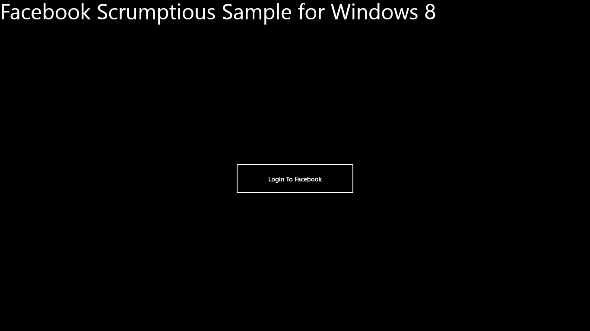
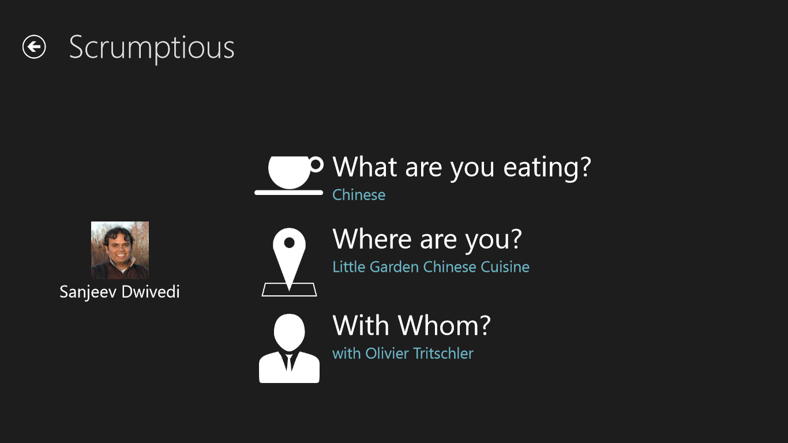
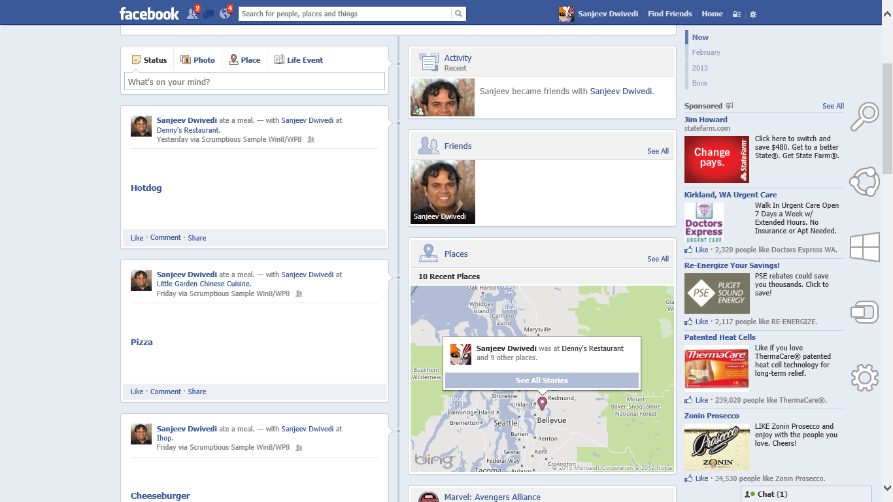
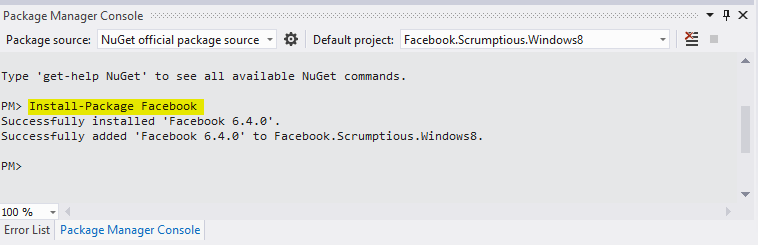
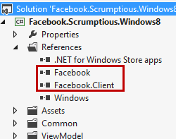
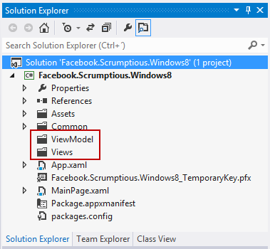
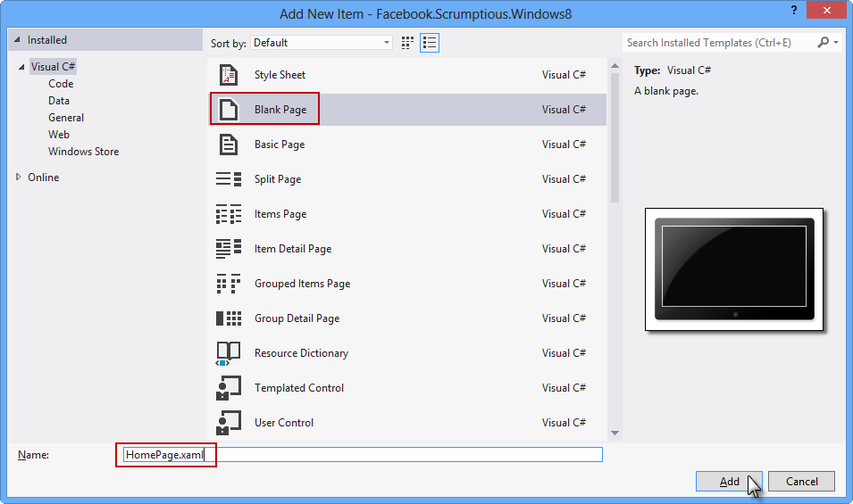
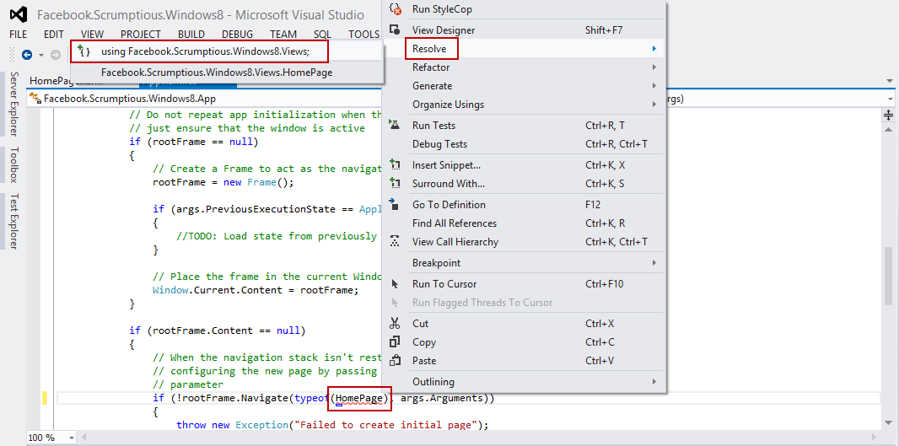
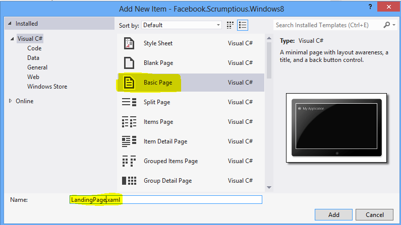
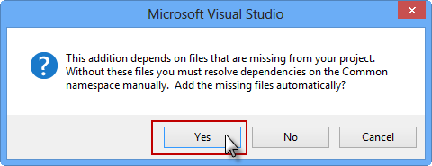

##Introduction

This multipart tutorial walks you through integrating Facebook into a C#/XAML based Windows Store app. You'll create a timeline app that lets people post about meals they ate.

This sample app is based on the Scrumptious sample app provided by Facebook for other mobile platforms.  The completed sample is present at [https://github.com/facebook-csharp-sdk/facebook-windows8-sample.git](https://github.com/facebook-csharp-sdk/facebook-windows8-sample.git "https://github.com/facebook-csharp-sdk/facebook-windows8-sample.git") Once you clone the repository, open the project Facebook.Scrumptious.Windows8 This is how the completed sample should look like. 

Facebook Login page

Scrumptious Landing Page

Posted event on your timeline

To complete the tutorial, you'll need some familiarity with Windows Store development. In particular, you will need familiarity with Visual Studio 2012 and being able to create and debug Windows Store projects in C# and XAML. Familiarity with Expression Blend for Visual Studio will be of additional benefit.

To get started, create a Visual Studio project using the Visual C# -> Windows Store -> Blank App. Let us call our app the Facebook.Scrumptious.Windows8. Install the Facebook nuget package into the solution by starting the Package Manager powershell by following:

Tools->Library Package Manager->Package Manager console

Once the powershell command prompt is running, type

"Install-Package Facebook"

This will download the nuget package and install the SDK into your project and add it to the references.

Once you've done that, work through the following steps of the tutorial:

*	Authenticate: Implement Facebook Login and ask the user for the permissions your app needs.
*	Personalize: Personalize the user's experience with their profile picture and name when they log in.
*	Show Friends: Display the user's friend list and let them select one or more friends.
*	Show Nearby Places: Display a list of nearby places and let the user tag their location.
*	Publish an Open Graph Action: Publish activity from your app to timeline and news feed, and set up the back-end server for Open Graph objects.

By the end of this tutorial, you should have a working understanding of how to log a user into to Facebook, personalize their experience and make an app social. Let's start the tutorial.

##Authenticate

###Setup the project

Create two folders called ViewModel and  Views in the project. This is how it will look like:

Delete the MainPage.xaml and MainPage.xaml.cs from the project. We will keep all our views in the Views Folder. Right click on the "Views" folder and select "Add New Item".  

Select Blank Page and name it HomePage.xaml. This page will host our Facebook login button.

Now in App.xaml.cs, change where it says MainPage to HomePage. This will make the application use the HomePage as the default page to start up with.

    if (!rootFrame.Navigate(typeof(MainPage), args.Arguments))

to 

    if (!rootFrame.Navigate(typeof(HomePage), args.Arguments))

This will show a Red line under the HomePage showing Visual Studio does not know where HomePage class is located. This can easily be resolved by right clicking on HomePage and selecting 'Resolve". 

You can also resolve this  by manually typing:

    using Facebook.Scrumptious.Windows8.Views; 

at the top of the page. In future references, I will assume that you know how to resolve a reference.

The HomePage will host our Facebook login button and the Facebook login code.

At this point, we will additionally add another page that we want to navigate to once the authentication has succeeded. To do so, just like before add another page using "Add new Item". This time, select Visual C# on the left in the Add Dialog and then select "Basic Page" in the middle pane. Name this page "LandingPage.xaml" 

This will show a prompt saying that to satisfy dependencies, more files will be automatically added. Say yes to this. This steps automatically adds files that allow easy navigation within Windows Store apps by providing Navigation Stack functionality. It automatically adds a back button to the landing page as well. The dependencies are brought in only once, so once you have added them, the next time you add a Basic page, you will not need to add them again. In future references, I will assume you know how to add Pages to the Views folder.

### Setup the User Interface

In App.xaml.cs add the following two variables to hold the Facebook OAuth Access Token and the User's ID once they have logged in into Facebook:

    internal static string AccessToken = String.Empty;
    internal static string FacebookId = String.Empty;

Now Replace the contents of HomePage.xaml with the following. All the following does is to add some text to the Page and a button for facebook login. Additionally, it says that the button click will be handled by an event handler named "btnFacebookLogin_Click".
    
    <Page
    x:Class="Facebook.Scrumptious.Views.HomePage"
    xmlns="http://schemas.microsoft.com/winfx/2006/xaml/presentation"
    xmlns:x="http://schemas.microsoft.com/winfx/2006/xaml"
    xmlns:local="using:Facebook.Scrumptious.Views"
    xmlns:d="http://schemas.microsoft.com/expression/blend/2008"
    xmlns:mc="http://schemas.openxmlformats.org/markup-compatibility/2006"
    mc:Ignorable="d">

        <Grid>

            <Grid.RowDefinitions>
                <RowDefinition Height="Auto"/>
                <RowDefinition Height="*"/>
            </Grid.RowDefinitions>
            <TextBlock Text="Facebook Scrumptious Sample for Windows 8" FontSize="50"/>
            <Button Grid.Row="1" Content="Login To Facebook" Height="73" HorizontalAlignment="Center" Name="btnFacebookLogin" VerticalAlignment="Center" Width="276" Click="btnFacebookLogin_Click" />

        </Grid>
    </Page>

Save the access token

Logout - reset App.AccessToken = String.Empty

Destroy the cookie

##Personalize

This tutorial outlines how to personalize your app experience with the Facebook SDK for Android by displaying the user's profile picture and name.

1. Setup the UI. Create a StackPanel with Image and TextBlock to hold the user's profile picture and their name.

Create three panels, one each for the restaurant, meal and friends. You can do this manually as well, but blend is a lot easier and faster. Setup event handlers for all the tap events.

2. Connecting to open graph actions

Look at the Open Graph API for reference on how to fetch various kinds of data. Use the GetDataAsync or PostDataAsync to navigate to the URL depending on operation. Passing the parameters is pretty easy by just creating a new object with properties set to the parameter names etc. No need to pre-create these objects.

 

Wire up so that as soon as user navigates to this page, their usename and picture is fetched and connected to the interface.

##Show Friends

We will now make the app a bit more interactive and let the user pick out their friends.

1. In the view model, create a class for representing a friend.

2. Create an static ObservableCollection of friends that you will later use to connect the UI to the data. Making it ObservableCollection allows you to use one of the strongest points of XAML, data binding.

3. Create the UI. Add a Listview to the UI. Edit item template in blend and add image and text box for friend names. Create data binding. Showcase what is happening under the hood. Allow multiselect on the list.

4. Hook into the listview select event and creaet a list of all the selected friends in the model for later use. Save it in the Data Model.

 

##Show Nearby Places

1. Add the UI on the Landing page to navigate to the place picking page and

2. In the event handler, write the code to initialize the Location sensor and get a location fix. We keep a default location in case the sensor has trouble getting a fix.

3. Using the location, make a graph query for restaurants. 

4. Update the data model with the list of restaurants

5. Create the Page for picking a location. Setup the UI for that. Drop a listbox, Setup the data binding for that. Pick the "additional templates", Create a template, - setup the UI by using an image, two textboxes and multiple grid/stack panels. See if you can update the UI to pick the dark blue state on selected state. On selection event, update the DataModel with the element that has been selected.

## Publish Open Graph Story

In this tutorial, you'll bring everything together and publish an Open Graph story. The previous steps let the user specify where they are and who they're with. Now, we'll implement a flow that lets the user select a meal and share what they're doing on their timeline.

Copy these three steps as is:

Step 1: Configure Open Graph in the App Dashboard
Step 2: Set Up Your Backend Server
Step 3: Publish a Test Action
 

Add the meal selection flow:

Setup the Data Model.
Setup the UI - listview, bound to the Data Model. On Select event, change the data model with what was selected
On Navigated event in Landing Page change the meal to the one you just selected.
Wire up the Appbar button to post the action to facebook
Congratulations, you just finished the Windows 8 tutorial.